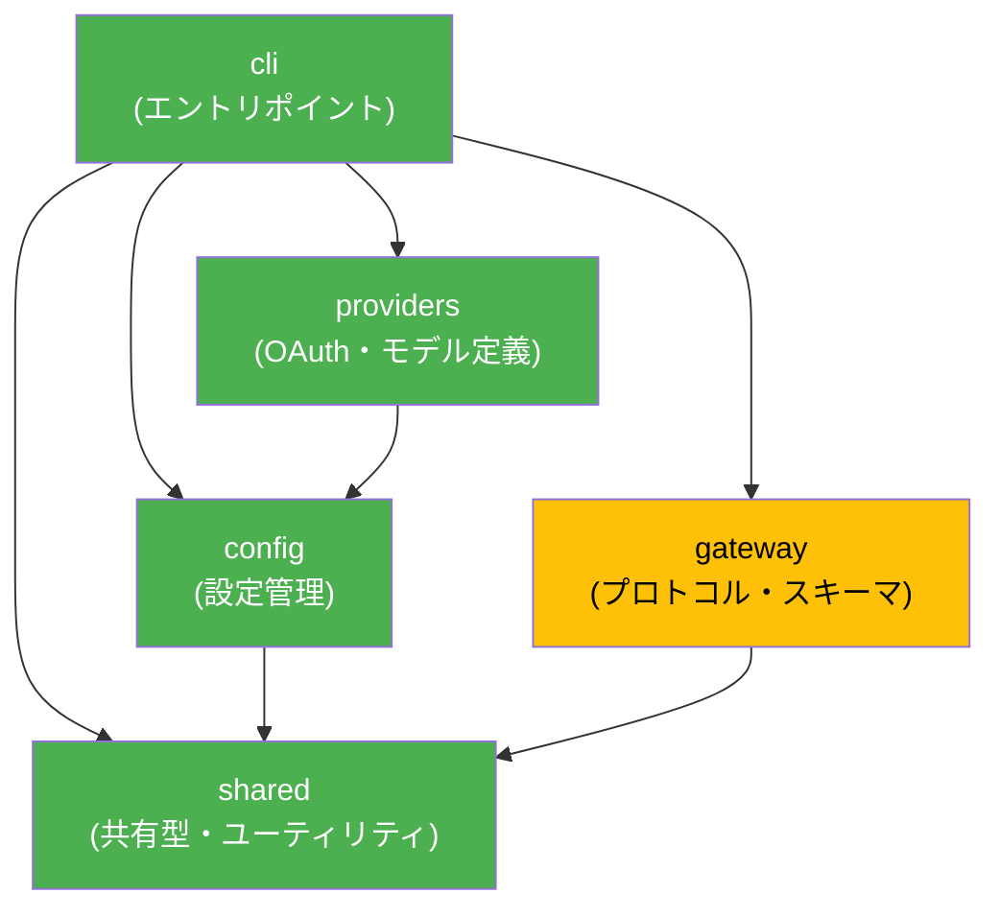

# TS→Rust モジュール対応マップ

OpenClaw (src/) の全モジュールと rustcalw (rust/crates/) の対応関係。

## 依存関係グラフ

## 移植フェーズ定義

| フェーズ | 対象 | 状態 | 概要 |
|---------|------|------|------|
| Phase 1 | config, shared | ✅ 完了 | 設定型定義・共有ユーティリティ (38+α モジュール) |
| Phase 2 | providers, gateway (型定義) | ✅ 完了 | OAuth・モデル定義、プロトコルスキーマ (30 モジュール) |
| Phase 3 | gateway (サーバー実装), cli 拡張 | 🔧 次フェーズ | WebSocket サーバー、ヘルスチェック、認証 |
| Phase 4 | channels, daemon, infra | 📋 計画 | チャネル統合、デーモン管理、IPC |
| Phase 5 | agents, commands, 残り全て | 📋 計画 | エージェントランタイム、全コマンド |

## 完全対応表

### Phase 1: 完了

#### shared (38モジュール, 175テスト)

| TS (src/shared/) | Rust (crates/shared/src/) | テスト数 |
|-----------------|--------------------------|---------|
| requirements.ts | requirements.rs | ✓ |
| chat-content.ts | chat_content.rs | ✓ |
| chat-envelope.ts | chat_envelope.rs | ✓ |
| chat-message-content.ts | chat_message_content.rs | ✓ |
| entry-metadata.ts | entry_metadata.rs | ✓ |
| entry-status.ts | entry_status.rs | ✓ |
| gateway-bind-url.ts | gateway_bind_url.rs | ✓ |
| node-list-types.ts | node_list_types.rs | ✓ |
| node-list-parse.ts | node_list_parse.rs | ✓ |
| node-match.ts | node_match.rs | ✓ |
| node-resolve.ts | node_resolve.rs | ✓ |
| session-types.ts | session_types.rs | ✓ |
| string-normalization.ts | string_normalization.rs | ✓ |
| string-sample.ts | string_sample.rs | ✓ |
| frontmatter.ts | frontmatter.rs | ✓ |
| config-eval.ts | config_eval.rs | ✓ |
| assistant-error-format.ts | assistant_error_format.rs | ✓ |
| assistant-identity-values.ts | assistant_identity_values.rs | ✓ |
| model-param-b.ts | model_param_b.rs | ✓ |
| subagents-format.ts | subagents_format.rs | ✓ |
| usage-types.ts | usage_types.rs | ✓ |
| text/code-regions.ts | text_code_regions.rs | ✓ |
| text/reasoning-tags.ts | text_reasoning_tags.rs | ✓ |
| text/join-segments.ts | text_join_segments.rs | ✓ |
| text/assistant-visible-text.ts | text_assistant_visible.rs | ✓ |
| config-ui-hints-types.ts | config_ui_hints_types.rs | ✓ |
| session-usage-timeseries-types.ts | session_usage_timeseries_types.rs | ✓ |
| text-chunking.ts | text_chunking.rs | ✓ |
| device-auth.ts | device_auth.rs | ✓ |
| device-auth-store.ts | device_auth_store.rs | ✓ |
| operator-scope-compat.ts | operator_scope_compat.rs | ✓ |
| avatar-policy.ts | avatar_policy.rs | ✓ |
| usage-aggregates.ts | usage_aggregates.rs | ✓ |
| pid-alive.ts | pid_alive.rs | ✓ |
| tailscale-status.ts | tailscale_status.rs | ✓ |
| net/url-userinfo.ts | url_userinfo.rs | ✓ |
| net/ip.ts | net_ip.rs | ✓ |
| net/ipv4.ts | net_ipv4.rs | ✓ |

**Rust パターンで代替**: global_singleton, lazy_runtime, process_scoped_map (TS 固有パターンのため Rust 標準パターンで代替)

#### config (4モジュール, 24テスト)

| TS (src/config/) | Rust (crates/config/src/) | テスト数 |
|-----------------|--------------------------|---------|
| types/ (schema) | types/ (agents, base, channels, gateway, hooks, messages, models, openclaw, secrets) | ✓ |
| paths.ts | paths.rs | ✓ |
| io (load/save) | io.rs | ✓ |
| env substitution | env_substitution.rs | ✓ |

### Phase 2: 完了

#### providers (5モジュール, 15テスト)

| TS (src/providers/) | Rust (crates/providers/src/) | テスト数 |
|--------------------|------------------------------|---------|
| (Rust 固有) | oauth_types.rs | ✓ |
| github-copilot-models.ts | github_copilot_models.rs | ✓ |
| github-copilot-auth.ts | github_copilot_auth.rs | ✓ |
| qwen-portal-oauth.ts | qwen_portal_oauth.rs | ✓ |
| kilocode-shared.ts | kilocode_shared.rs | ✓ |

#### gateway (25モジュール, 121テスト)

| TS (src/gateway/) | Rust (crates/gateway/src/) | テスト数 |
|-------------------|---------------------------|---------|
| protocol/client-info.ts | client_info.rs | ✓ |
| method-scopes.ts | method_scopes.rs | ✓ |
| role-policy.ts | role_policy.rs | ✓ |
| protocol/connect-error-details.ts | connect_error_details.rs | ✓ |
| protocol/schema/error-codes.ts | error_codes.rs | ✓ |
| protocol/schema/frames.ts + types.ts | protocol_frames.rs | ✓ |
| protocol/schema/primitives.ts | schema_primitives.rs | ✓ |
| protocol/schema/config.ts | schema_config.rs | ✓ |
| protocol/schema/devices.ts | schema_devices.rs | ✓ |
| protocol/schema/secrets.ts | schema_secrets.rs | ✓ |
| protocol/schema/push.ts | schema_push.rs | ✓ |
| protocol/schema/sessions.ts | schema_sessions.rs | ✓ |
| protocol/schema/agent.ts | schema_agent.rs | ✓ |
| protocol/schema/snapshot.ts | schema_snapshot.rs | ✓ |
| protocol/schema/logs-chat.ts | schema_logs_chat.rs | ✓ |
| protocol/schema/wizard.ts | schema_wizard.rs | ✓ |
| protocol/schema/agents-models-skills.ts | schema_agents_models_skills.rs | ✓ |
| protocol/schema/channels.ts | schema_channels.rs | ✓ |
| protocol/schema/nodes.ts | schema_nodes.rs | ✓ |
| protocol/schema/exec-approvals.ts | schema_exec_approvals.rs | ✓ |
| protocol/schema/cron.ts | schema_cron.rs | ✓ |
| server/close-reason.ts | close_reason.rs | ✓ |
| server-constants.ts | server_constants.rs | ✓ |
| security-path.ts | security_path.rs | ✓ |
| origin-check.ts | origin_check.rs | ✓ |

### Phase 3: 次フェーズ (gateway サーバー実装)

| TS (src/gateway/) | Rust (予定) | 難易度 | 備考 |
|-------------------|------------|--------|------|
| server/gateway-server.ts | gateway/server.rs | 高 | WebSocket サーバー (tokio-tungstenite) |
| server/ws-handler.ts | gateway/ws_handler.rs | 高 | フレームルーティング |
| server/auth.ts | gateway/auth.rs | 中 | チャレンジ署名認証 |
| server/health.ts | gateway/health.rs | 低 | /healthz, /readyz |
| server/http-routes.ts | gateway/http_routes.rs | 中 | Control UI, Canvas, webhook |
| server-reload-handlers.ts | gateway/reload.rs | 高 | SIGUSR1 代替が必要 (ADR-002) |

### Phase 4: 計画 (channels, daemon, infra)

| TS モジュール | Rust (予定) | 難易度 | 備考 |
|-------------|------------|--------|------|
| channels/ | channels crate | 中 | チャネル統合ロジック |
| routing/ | channels/routing.rs | 低 | メッセージルーティング |
| daemon/ | daemon crate | 中 | schtasks/launchd/systemd 抽象化 |
| infra/exec-approvals.ts | platform/ipc.rs | 高 | Unix socket → Named Pipe (ADR-002) |
| infra/restart.ts | platform/signal.rs | 高 | SIGUSR1 代替 (ADR-002) |
| process/ | process crate | 中 | kill-tree, supervisor |

### Phase 5: 計画 (agents, 残り全て)

| TS モジュール | Rust (予定) | 難易度 | 備考 |
|-------------|------------|--------|------|
| agents/ | agents crate | 高 | エージェントランタイム・ツール実行 |
| agents/sandbox/ | agents/sandbox.rs | 高 | Docker 管理 (オプショナル) |
| commands/ | cli/commands/ | 中 | 全サブコマンド実装 |
| sessions/ | sessions crate | 中 | セッション管理 |
| plugins/ | plugins crate | 高 | プラグインロード・FFI |
| security/ | security crate | 中 | ACL・認証 |
| browser/ | — | — | Playwright 依存、Rust 移植対象外の可能性 |
| media/ | — | — | FFmpeg 依存、Rust 移植対象外の可能性 |

## 未移植モジュール統計

| カテゴリ | TS モジュール数 (概算) | 移植済み | 残り |
|---------|---------------------|---------|------|
| shared | 38+ | 38 | 0 |
| config | 10+ | 4 | ~6 (バリデーション等) |
| providers | 25+ | 5 | ~20 (各プロバイダー) |
| gateway | 50+ | 25 | ~25 (サーバー実装) |
| channels | 20+ | 0 | ~20 |
| agents | 30+ | 0 | ~30 |
| cli/commands | 15+ | 1 | ~14 |
| その他 | 30+ | 0 | ~30 |
| **合計** | **~220** | **73** | **~145** |
